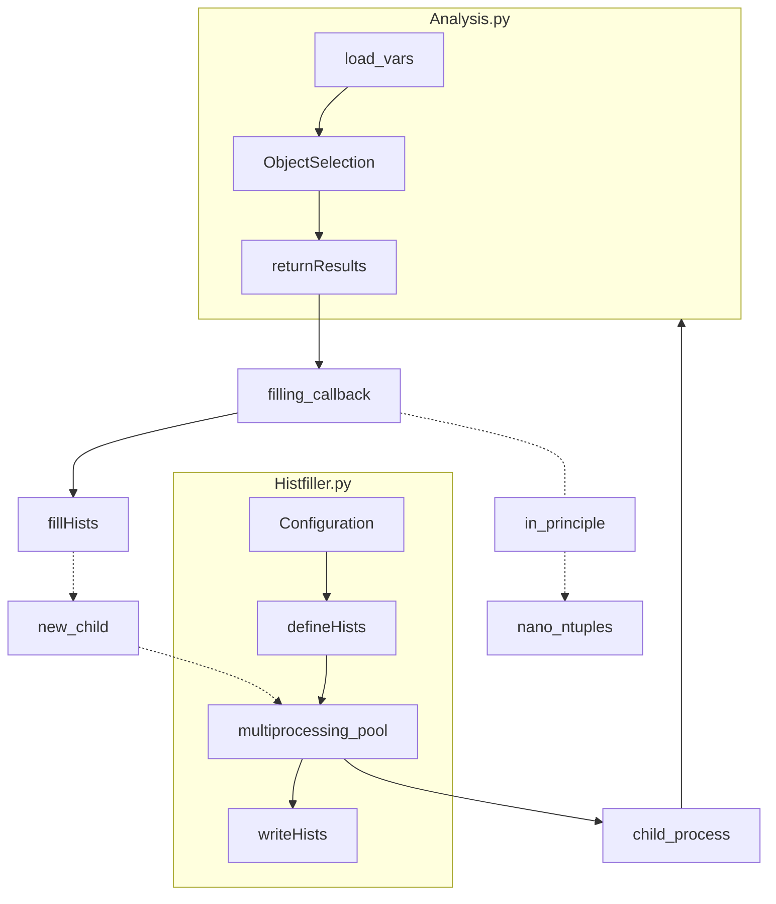

pyhh is a python only analysis framework processing ntuples from the easyJet framework as inputs to do a boosted VBF HH->4b analysis. 

| script          | description                                                                                                                                                                                                                           |
| --------------- | ------------------------------------------------------------------------------------------------------------------------------------------------------------------------------------------------------------------------------------- |
| `HistFiller.py` | Driver script to fill histograms configured with `Configuration.py`. Runs object selection code from `Analysis.py` per file. Can run over several files or just one with the `--file` option. Outputs an .h5 file with the histograms |
| `HistDefs.py`   | Definitions for the histograms to fill                                                                                                                                                                                                |
| `Merger.py`     | Merge hists from e.g. one dataset by adding up hists from given files                                                                                                                                                                 |
| `Plotter.py`    | has all the plots and is still under very heavy development                                                                                                                                                                           |
| `Fitting.py`    | yet to come                                                                                                                                                                                                                           |

