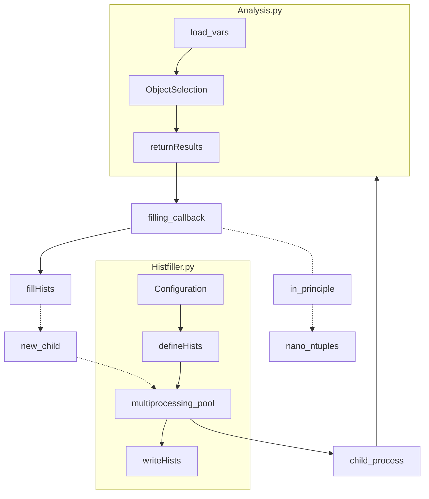

```mermaid
flowchart TB

    subgraph Analysis.py
    load_vars --> ObjectSelection
    ObjectSelection --> returnResults
    end

    multiprocessing_pool --> child_process--> Analysis.py
    returnResults --> filling_callback
    filling_callback --> fillHists -.-> new_child -.-> multiprocessing_pool
    filling_callback -.- in_principle -.-> nano_ntuples

    subgraph Histfiller.py
    Configuration --> defineHists
    defineHists --> multiprocessing_pool
    multiprocessing_pool --> writeHists
    end
```

