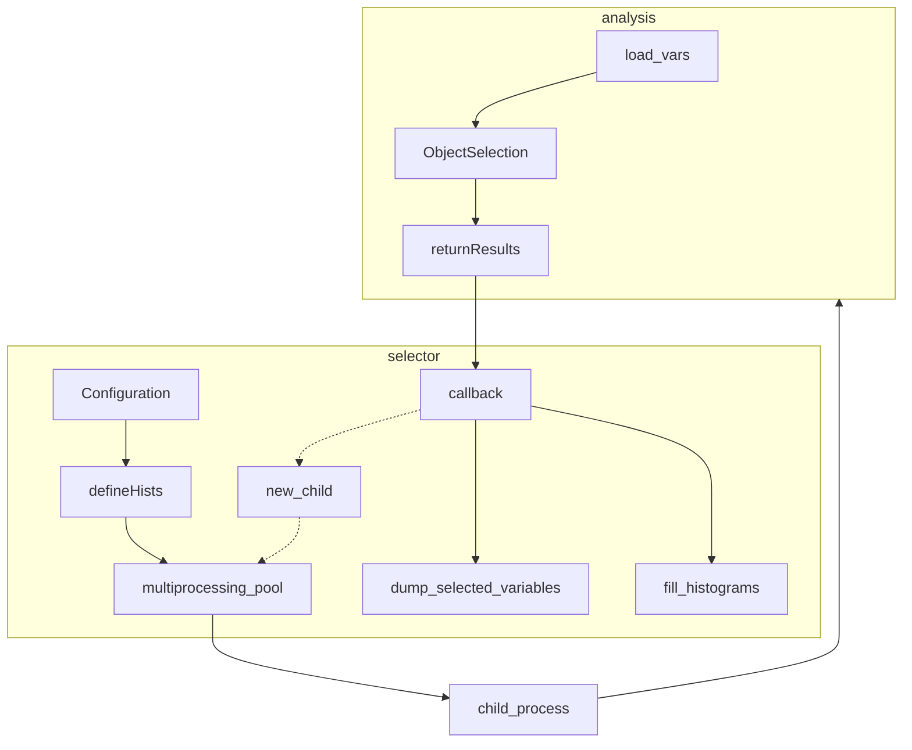

The entrance program for the selector is selector.main.py. Its capable of multiprocessing. Configuration can be found in selector.configuration.py

```mermaid
flowchart TB

    subgraph analysis
    load_vars --> ObjectSelection
    ObjectSelection --> returnResults
    end

    multiprocessing_pool --> child_process--> analysis
    returnResults --> callback


    subgraph selector
    Configuration --> defineHists
    defineHists --> multiprocessing_pool
    callback ---> dump_selected_variables
    callback ---> fill_histograms
    callback -.-> new_child -.-> multiprocessing_pool

    end
```

